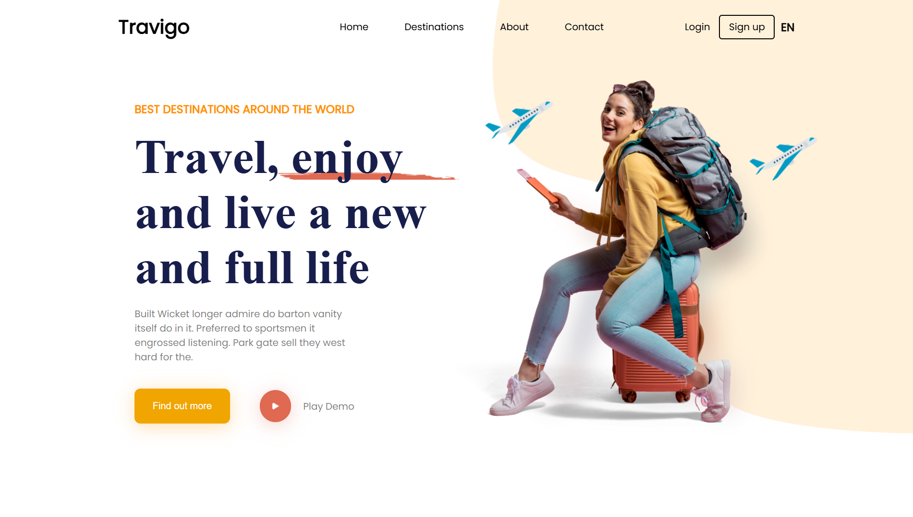

<h1 align="center">✈️ TRAVIGO - Site Web Vitrine</h1>
<p align="center">Un site vitrine moderne et responsive pour une agence de voyages internationale.</p>

<p align="center">
  
</p>

---

## 🧭 Présentation du projet

Ce projet est un **site web vitrine** que j’ai conçu et développé pour **TRAVIGO**, une agence spécialisée dans l’organisation de voyages, d’excursions et de séjours à travers le monde.  
L’objectif était de créer une **interface moderne, attractive et simple à naviguer**, tout en respectant une identité visuelle professionnelle.

---

## 🌐 Contenu du site

Le site est composé de plusieurs pages principales :

- 🏠 **Page d’accueil** : une présentation claire de TRAVIGO, avec une grande bannière et une mise en avant des services proposés.  
- 🏝️ **Page Destinations** : une page dédiée aux différents **pays et circuits** proposés par l’agence.  
- 🧭 **Page À propos** : une section qui raconte **l’histoire de TRAVIGO**, ses valeurs, sa mission et son engagement envers ses clients.  
- 📩 **Page Contact** : un formulaire simple et fonctionnel qui permet aux visiteurs de **poser leurs questions ou demander un devis**.

---

## 🧑‍💻 Ce que j’ai réalisé

- Intégration complète de la maquette Figma en HTML et CSS.  
- Conception et développement des pages *Destinations*, *À propos* et *Contact*.  
- Mise en place d’un design responsive qui s’adapte aux ordinateurs, tablettes et smartphones.  
- Vérification du code via [W3C Validator](https://validator.w3.org/).  
- Respect des bonnes pratiques HTML / CSS (Flexbox & Grid).

---

## 🧰 Technologies utilisées

- HTML5  
- CSS3  
- Responsive Design  
- Figma (pour la conception)

---

## 📝 Liens du projet

- 🎨 **Maquette Figma** → [Voir la maquette](https://www.figma.com/design/OOWL04a1CVuGyo4WVxjTUH/travel-website-landing-page-genzdevs-68e7ca81ea486124610984?node-id=0-1&t=4VKD6WHQVh51qfGH-1)  

- 🗂️ **Jira - Planification Agile** → [Accéder au board](https://imadelmasoudy.atlassian.net/jira/software/projects/KAN/boards/1?atlOrigin=eyJpIjoiYjY5MmU5MjM2ZmViNGM5Yjg2Njc1MzNlMTBlMTM3M2MiLCJwIjoiaiJ9)

---

## 🚀 Tester le projet localement

1. Cloner le dépôt :
   ```bash
   git clone https://github.com/imadprogram/travigo-design.git
